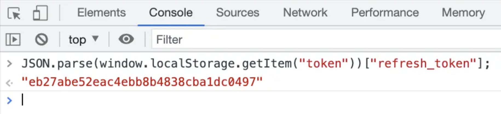
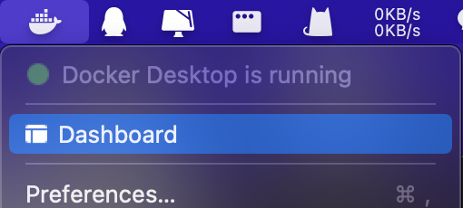
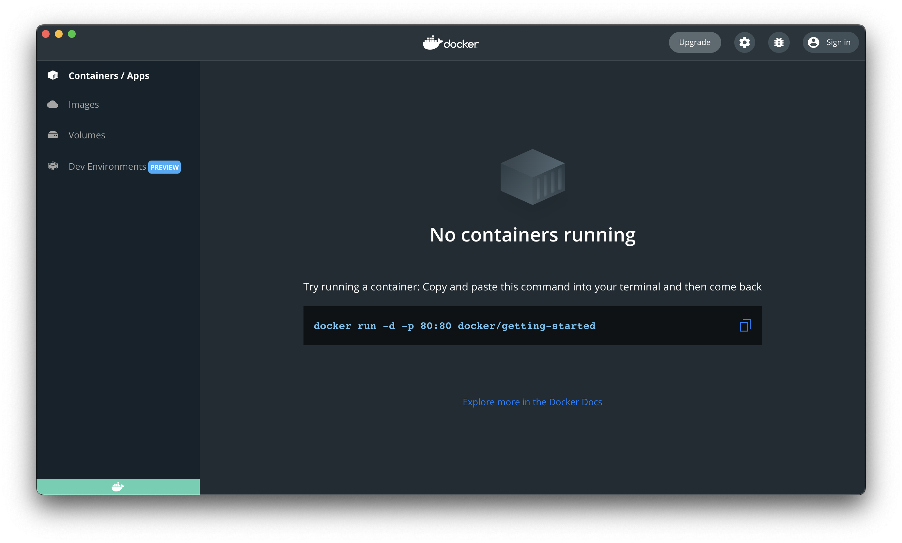
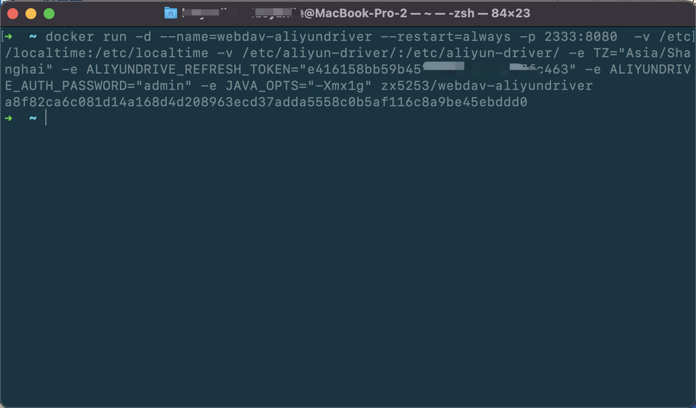
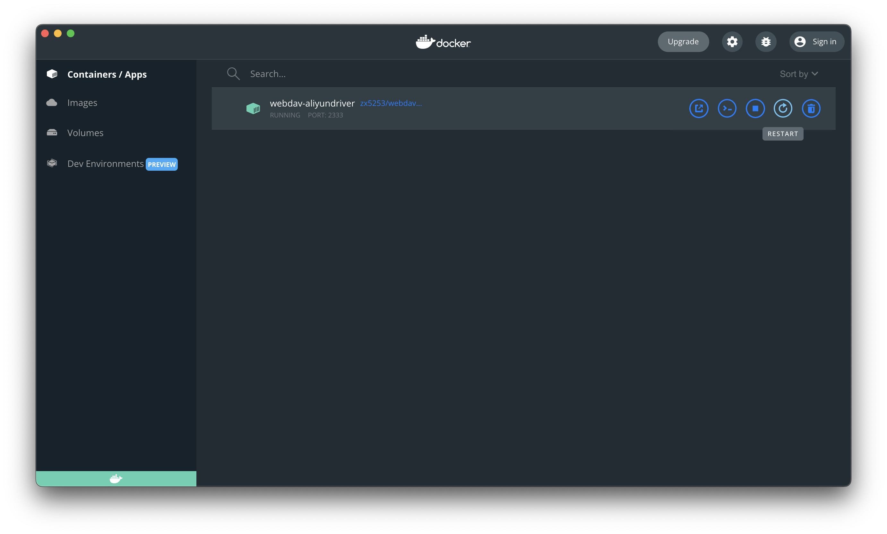
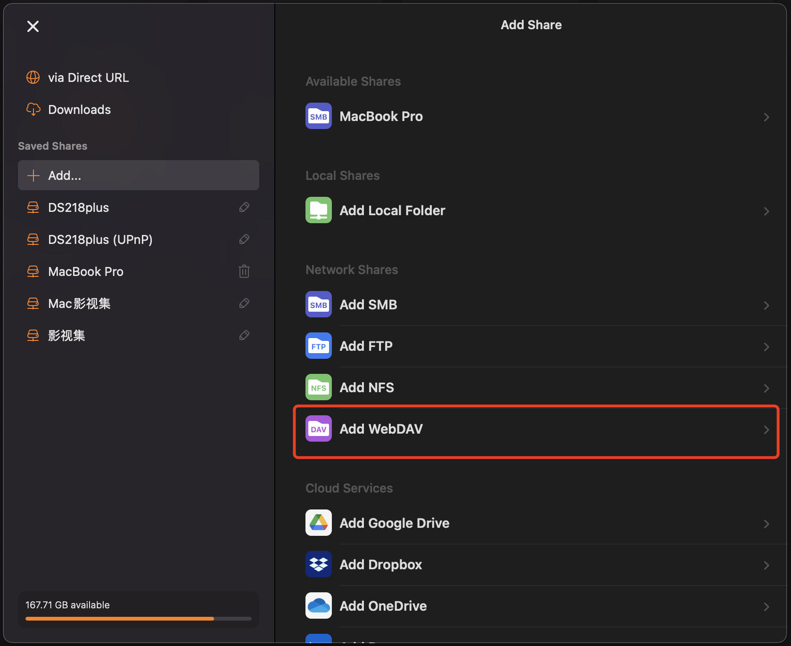
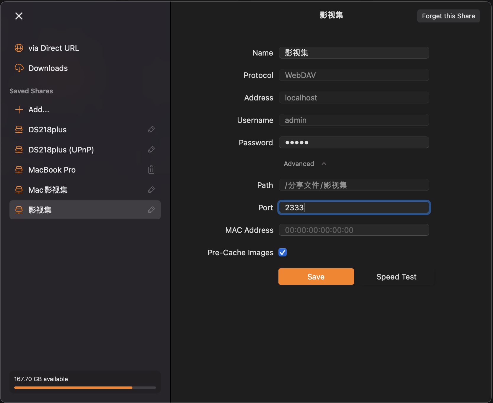
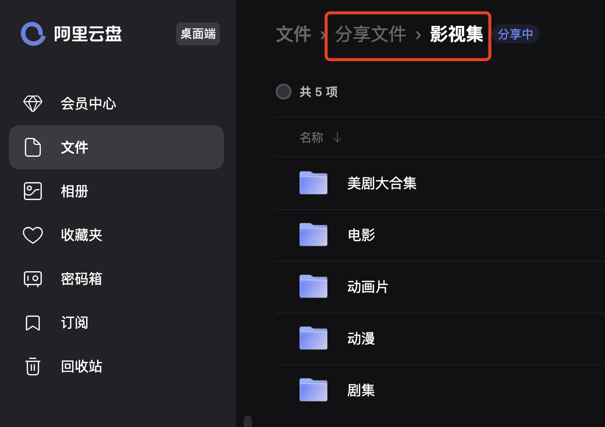
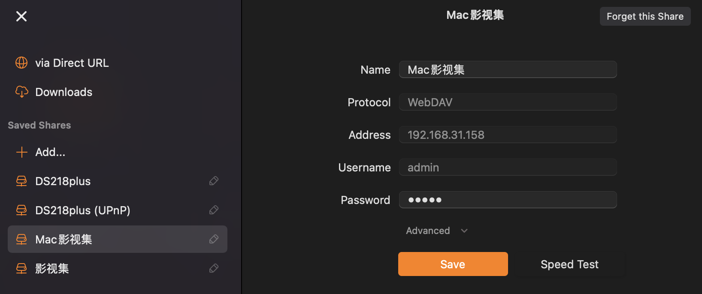
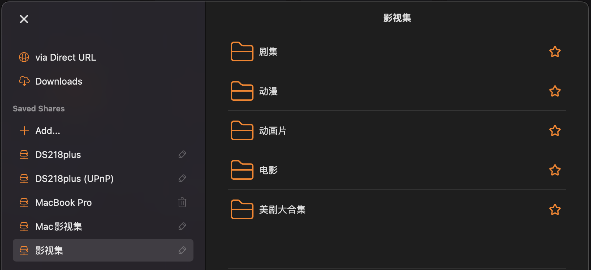

## 前言

一般云盘都会自带视频播放功能。但是播放高分辨率视频、自定义字幕样式、外挂字幕、选择视频内建字幕这些功能，对于一个主要用作存储功能的云盘来说就捉襟见肘了。

所以通过 [WebDAV](https://zh.wikipedia.org/wiki/%E5%9F%BA%E4%BA%8EWeb%E7%9A%84%E5%88%86%E5%B8%83%E5%BC%8F%E7%BC%96%E5%86%99%E5%92%8C%E7%89%88%E6%9C%AC%E6%8E%A7%E5%88%B6) 协议把云盘挂载到本地，然后用专业的视频播放器串流播放是一种更好的选择。
<!--more-->
WebDAV 是 HTTP 协议的扩展，可以很方便的帮助用户对网络服务器上的资源进行复制、移动、删除等操作。

按道理说，作为云存储提供商，支持 WebDAV 更加方便用户应该是理所当然的事，但现实情况是很多大型云存储服务商都不支持 WebDAV，国内外情况都差不多。在[知乎某条帖子](https://www.zhihu.com/question/30719209)下看到[坚果云](https://www.jianguoyun.com/)(它支持 WebDAV😃)的说法如下，似乎有点道理:  

> **为何国内多数网盘商都不支持 WebDAV ？**
> 国内多数网盘商都不支持 WebDAV，主要原因为若国内网盘都支持 WebDAV，部分用户就可以不用特地去下载网盘的客户端，即可在其他的 App 中使用到云盘的服务。比如扫描后将资料上传至网盘，批注后将文档上传至网盘。
> 对于网盘服务商来说，相应的，App 关注度、客户端下载量、用户活跃度、广告展现和推送等都会减少，公司的运营势必会受到一定影响。这个分析确实有理，并且这与国内缺乏“生态”的行业现状有直接关联。

## 搭建条件
### webdav-aliyundriver
webdav-aliyundriver 是一个开源项目: [https://github.com/zxbu/webdav-aliyundriver](https://github.com/zxbu/webdav-aliyundriver)
前面我们说过了阿里云盘不支持 WebDAV ，它实现了阿里云盘的WebDAV 协议。(还不快点进去给大佬疯狂 Star)

### 阿里云盘 refreshToken
refreshToken 即刷新令牌，用于获取和刷新访问你云盘里资源权限的 accessToken，这两个 Token 涉及到专业知识具体就不多啰嗦，感兴趣的同学自行百度，这里说一下怎么拿。

1、先通过浏览器（建议chrome）打开[阿里云盘官网](https://www.aliyundrive.com)并登录
2、登录成功后，按 F12 打开开发者工具，点击 Console，输入以下代码，并回车

```js
JSON.parse(window.localStorage.getItem("token"))["refresh_token"];
```



或者按照 [webdav-aliyundriver 提到的方式](https://github.com/zxbu/webdav-aliyundriver#%E6%B5%8F%E8%A7%88%E5%99%A8%E8%8E%B7%E5%8F%96refreshtoken%E6%96%B9%E5%BC%8F) 也可以。

### Docker 客户端和 webdav-aliyundriver 镜像
Docker 是一个开源的应用容器引擎，可以用来在本地管理运行很多服务或应用。
由于这些服务或应用都是以镜像方式运行，环境都会自动配置，所以非常方便管理也很少出现问题。
唯一的缺点可能就是比较吃内存，取决于你运行的程序。

Docker 的镜像都存在 Docker hub，方便开发者更新和用户下载。webdav-aliyundriver 的镜像地址: [https://hub.docker.com/r/zx5253/webdav-aliyundriver](https://hub.docker.com/r/zx5253/webdav-aliyundriver)。(无需下载，稍后通过命令行自动下载)

Docker 客户端下载: [https://www.docker.com/get-started/](https://www.docker.com/get-started/)。

### Infuse 客户端
解码能力很强的付费流媒体播放器，支持多种文件协议，包括我们稍后要用到的 WebDAV。
不多啰嗦介绍了，这里有篇少数派介绍 Infuse  的文章: [https://sspai.com/post/68706](https://sspai.com/post/68706)。

## 开始搭建
### 1、安装 Docker 客户端
软件安装没啥可说的，一直下一步就可以，有手就会。这里主要说一些细节。
Docker 装好后首次启动可能看不到界面，在电脑状态栏点 Docker 图标 > Dashboard 即可打开。

Containers/Apps 是空的。


### 2、通过 Terminal (Command) 运行一个 webdav-aliyundriver 镜像
命令如下

```shell
docker run -d --name=webdav-aliyundriver --restart=always -p 2333:8080  -v /etc/localtime:/etc/localtime -v /etc/aliyun-driver/:/etc/aliyun-driver/ -e TZ="Asia/Shanghai" -e ALIYUNDRIVE_REFRESH_TOKEN="阿里云盘 refreshToken" -e ALIYUNDRIVE_AUTH_PASSWORD="admin" -e JAVA_OPTS="-Xmx1g" zx5253/webdav-aliyundriver
```

这里需要注意的就几个参数

> **2333** 是 WebDAV 连接端口，在可用范围内(0 ～ 65535)随便改
> **8080** 是容器端口，不要改，除非你知道该怎么改
> **ALIYUNDRIVE_REFRESH_TOKEN** 是前面拿到的阿里云盘 refreshToken
> **ALIYUNDRIVE_AUTH_PASSWORD** 是 WebDAV 登录密码，可以修改，用户名默认也是 **admin**
> 其它参数默认不用动了

修改好参数，在 Terminal 执行即可



这里会从 Dockerhub 自动下载镜像 zx5253/webdav-aliyundriver，不翻墙的话可能比较慢。
启动成功后，在 Docker Dashboard 可以看到正在运行的镜像。
之后只就可以在 Dashboard 里进行开关、重启等操作。



### 3、在 Infuse 中连接 WebDAV
安装并启动 Infuse 客户端
在 Infuse 中找到新增文件来源 > 添加共享 > 网络分享 > 添加 WebDAV

填写相应信息


> 注意这里的 **位置(Address)、路径(Path)和端口(Port)** 。
> 位置因为是本机跑的 Docker，所以直接填 `localhost` 或者 `127.0.0.1` 都可以，如果是在 NAS 上跑的 Docker 就填 NAS 的 IP。
> 路径根据你自己云盘里的目录层级填。
> 
> 
> 
> 端口号在 Docker Dashbord 可以看到

如果需要在本地其他设备共享，只需要把上面的位置(Address)改成电脑的 IP 即可，其它参数不变。
然后在局域网下，你的Pad 或者手机就直接挂载电脑上运行的 WebDAV 容器



所有信息填好保存，信息无误的话，很快 Infuse 就会识别出你的云盘目录。
然后就可以像本地文件一样愉快的打开看片了。



Infuse 内置的刮削器也很强，只要文件命名规范基本都可以识别出来。


播放 4K 视频时，看了下带宽占用，下行基本是在 10MB/s 左右，暂停播放时会缓存一段时间，100 兆带宽足够很流畅的串流播放了。

### 资源分享

|名称 | 链接 |              
|:--|:--|            
|影视大合集 4TB   |   [https://www.aliyundrive.com/s/42GyCgAYcCS](https://www.aliyundrive.com/s/42GyCgAYcCS)|

| 剧集  |  链接 |              
|:--|:--|
| 黑镜   | [https://www.aliyundrive.com/s/ebhhzyw3GQc](https://www.aliyundrive.com/s/ebhhzyw3GQc) |
|越狱|[https://www.aliyundrive.com/s/88Go9XcyNpG](https://www.aliyundrive.com/s/88Go9XcyNpG)|
| 致命女人| [https://www.aliyundrive.com/s/snoG7FZaxDX](https://www.aliyundrive.com/s/snoG7FZaxDX) |
| 肇事逃逸 | [https://www.aliyundrive.com/s/VCG7aXyLgA5](https://www.aliyundrive.com/s/VCG7aXyLgA5) |
| 绝命毒师 | [https://www.aliyundrive.com/s/HpJd2mhahUv](https://www.aliyundrive.com/s/HpJd2mhahUv) |
| 纸牌屋 | [https://www.aliyundrive.com/s/wcy3tYM5BDi](https://www.aliyundrive.com/s/wcy3tYM5BDi) |
| 纸房子 | [https://www.aliyundrive.com/s/Fe5HTvyEBRk](https://www.aliyundrive.com/s/Fe5HTvyEBRk) |
| 紧急呼救 | [https://www.aliyundrive.com/s/5kkSw4t1gEs](https://www.aliyundrive.com/s/5kkSw4t1gEs) |
| 神盾局特工 | [https://www.aliyundrive.com/s/QEbw6h7z6VB](https://www.aliyundrive.com/s/QEbw6h7z6VB) |
| 曼达洛人 | [https://www.aliyundrive.com/s/dUGCu8CfSWp](https://www.aliyundrive.com/s/dUGCu8CfSWp) |
| 无耻之徒 | [https://www.aliyundrive.com/s/iF5pyr3z249](https://www.aliyundrive.com/s/iF5pyr3z249) |
| 无罪之最 | [https://www.aliyundrive.com/s/R2Yrn2n6nwW](https://www.aliyundrive.com/s/R2Yrn2n6nwW) |
| 太阳召唤 | [https://www.aliyundrive.com/s/1QqUH4wz75V](https://www.aliyundrive.com/s/1QqUH4wz75V) |
| 为全人类 | [https://www.aliyundrive.com/s/223Ui3ShgUf](https://www.aliyundrive.com/s/223Ui3ShgUf) |
| 超人和路易斯 | [https://www.aliyundrive.com/s/2bsFN4FEZNY](https://www.aliyundrive.com/s/2bsFN4FEZNY) |
| 老友记| [https://www.aliyundrive.com/s/iDRzQC4feZ9](https://www.aliyundrive.com/s/iDRzQC4feZ9) |
| 基地 | [https://www.aliyundrive.com/s/A5gJVCXd37z](https://www.aliyundrive.com/s/A5gJVCXd37z) |
| 后翼弃兵 | [https://www.aliyundrive.com/s/KcViepfjkQS](https://www.aliyundrive.com/s/KcViepfjkQS) |
| 僵尸校园 | [https://www.aliyundrive.com/s/MFurHQC36cb](https://www.aliyundrive.com/s/MFurHQC36cb) |
| 东城梦魇 | [https://www.aliyundrive.com/s/qJ8tY2nB9pg](https://www.aliyundrive.com/s/qJ8tY2nB9pg) |
| 黄石 | [https://www.aliyundrive.com/s/KUDbh4oXnrr](https://www.aliyundrive.com/s/KUDbh4oXnrr) |
| 硅谷 | [https://www.aliyundrive.com/s/t7UyjneXHpp](https://www.aliyundrive.com/s/t7UyjneXHpp) |

| 动漫  |  链接 |              
|:--|:--|
| 鬼灭之刃 | [https://www.aliyundrive.com/s/wAyLYaugvih](https://www.aliyundrive.com/s/wAyLYaugvih) |
| 鬼灭之刃 那田蜘蛛山篇 | [https://www.aliyundrive.com/s/5mkcGXbFzR3](https://www.aliyundrive.com/s/5mkcGXbFzR3) |
| 鬼灭之刃 游郭篇 | [https://www.aliyundrive.com/s/g3w3jfmvrMP](https://www.aliyundrive.com/s/g3w3jfmvrMP) |
| 鬼灭之刃 无限列车篇 | [https://www.aliyundrive.com/s/Dgu9jRmPGcw](https://www.aliyundrive.com/s/Dgu9jRmPGcw) |
| 鬼灭之刃 柱众会议・蝶屋敷篇 | [https://www.aliyundrive.com/s/i9WrsbhgTja](https://www.aliyundrive.com/s/i9WrsbhgTja) |
| 鬼灭之刃 剧场版 无限列车篇 | [https://www.aliyundrive.com/s/n4UExXfVfpZ](https://www.aliyundrive.com/s/n4UExXfVfpZ) |
| 鬼灭之刃 兄妹的羁绊 | [https://www.aliyundrive.com/s/znh2GuBmnax](https://www.aliyundrive.com/s/znh2GuBmnax) |
| 鬼灭之刃 初高一体!! 鬼灭学园物语 情人节篇 | [https://www.aliyundrive.com/s/tgHZ2bgPWkQ](https://www.aliyundrive.com/s/tgHZ2bgPWkQ) |

| 科幻/奇幻 |  链接 |              
|:--|:--|
| 钢铁侠1 | [https://www.aliyundrive.com/s/e7nmJt1rTPF](https://www.aliyundrive.com/s/e7nmJt1rTPF) |
| 钢铁侠2 | [https://www.aliyundrive.com/s/WTAv2RVSF6s](https://www.aliyundrive.com/s/WTAv2RVSF6s) |
| 钢铁侠3 | [https://www.aliyundrive.com/s/V4d3SgACuTB](https://www.aliyundrive.com/s/V4d3SgACuTB) |
| 雷神 | [https://www.aliyundrive.com/s/ghWQ6RSLNSc](https://www.aliyundrive.com/s/ghWQ6RSLNSc) |
| 雷神2：黑暗世界 | [https://www.aliyundrive.com/s/KfSf44TUDxj](https://www.aliyundrive.com/s/KfSf44TUDxj) |
| 雷神3：诸神黄昏 | [https://www.aliyundrive.com/s/C84TgrSfdRq](https://www.aliyundrive.com/s/C84TgrSfdRq) |
| 银河护卫队 | [https://www.aliyundrive.com/s/J54C2bsVSFA](https://www.aliyundrive.com/s/J54C2bsVSFA) |
| 银河护卫队2 | [https://www.aliyundrive.com/s/b4HJEq1gb6N](https://www.aliyundrive.com/s/b4HJEq1gb6N) |
| 加勒比海盗1：黑珍珠号的诅咒 | [https://www.aliyundrive.com/s/Dv6W74xYvap](https://www.aliyundrive.com/s/Dv6W74xYvap) |
| 加勒比海盗2：聚魂棺 | [https://www.aliyundrive.com/s/sTU8Fc7kvyd](https://www.aliyundrive.com/s/sTU8Fc7kvyd) |
| 加勒比海盗3：世界的尽头 | [https://www.aliyundrive.com/s/JktaWaRtpw7](https://www.aliyundrive.com/s/JktaWaRtpw7) |
| 加勒比海盗4：惊涛怪浪 | [https://www.aliyundrive.com/s/SPLZdqkDogP](https://www.aliyundrive.com/s/SPLZdqkDogP) |
| 加勒比海盗5：死无对证 | [https://www.aliyundrive.com/s/UujeKouD6F5](https://www.aliyundrive.com/s/UujeKouD6F5) |

**更多资源加入 QQ 频道获取**: [影视资源库](https://qun.qq.com/qqweb/qunpro/share?_wv=3&_wwv=128&appChannel=share&inviteCode=Z6Gv5&appChannel=share&businessType=9&from=181074&biz=ka&shareSource=5)
